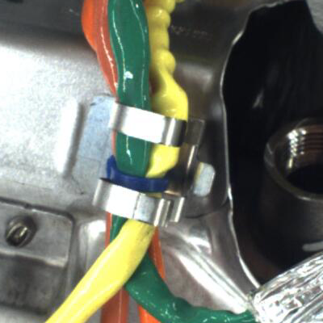
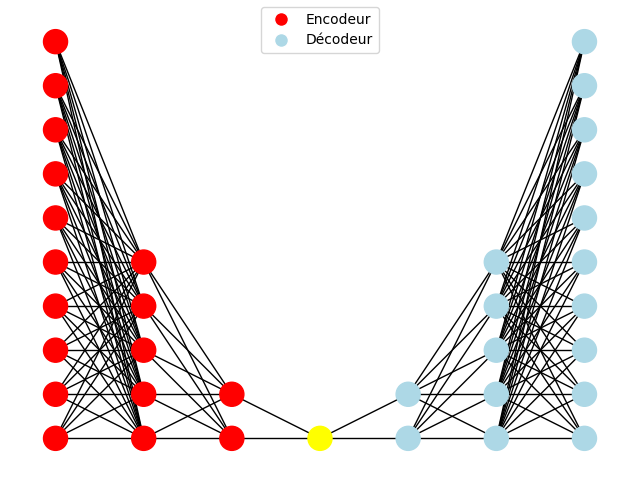

# Detection-d-anomalies

L’objectif principal de ce projet est de concevoir et d’entraîner un modèle de
Deep Learning dédié à la détection d’anomalies dans un contexte industriel. Plus
précisément, nous travaillerons avec une base de données publique composée
d’images de câblages de voitures. Tout au long de ce projet, les étudiants
seront amenés à explorer les étapes clés du développement et de l’application
d’un modèle d’apprentissage profond. L’approche retenue mettra l’accent sur
l’utilisation d’**autoencodeurs**, un type de réseau de neurones largement utilisé
pour les tâches de reconstruction et de détection d’anomalies.

Utilisation de **AutoVi dataset**

Image : de taille : (*400x400*)

## Analyse du sujet et déroulement
Nous allons utiliser des autoencodeurs afin de créer un modèle de Deep Learning permettant la détection d'anomalies industrielles d'une base de données d'images de cablage de voitures.
Pour ce qui est du regroupement des photos d'entraînement, nous avons utilisé le dataset engine_wiring de la base de données AutoVi Dataset (https://autovi.utc.fr/index_fr.html)

License:
Copyright © 2023-2024 Renault Group
This work is licensed under a Creative Commons Attribution-NonCommercial-ShareAlike 4.0 International License. To view a copy of the license, visit https://creativecommons.org/licenses/by-nc-sa/4.0/.

## Utilisation de modèle autoencodeurs

> AutoEncodeur :
>

**Apprentissage non supervisé (images pas étiquetées)**
*But apparemment*: c'est de compresser (**encoder**) et décompresser (**décoder**) les données  
il met en valeur les variables latentes (ce qui fait varier la catégorisation des images), pour les choisir: **goulot d'étranglement**   
**Espace latent**: ensemble des variables latentes. 
l'autoencodeurs choisira ensuite quelles _variables latentes_ il garde pour décoder au mieux (le plus identiquement possible à l'original) les images
taches génératives d'immages: (**VAE et AAE**) 
Ces frameworks interviennent dans divers modèles d’apprentissage profond : par exemple dans les architectures de réseaux neuronaux convolutifs (CNN), utilisées dans les tâches de vision par ordinateur comme la segmentation d’images, ou dans les architectures de réseaux neuronaux récurrents (RNN), utilisées dans les tâches de séquence à séquence (seq2seq).
Segmentation d'image: segmenter l'image en groupes de pixels ayant les mêmes caractéristiques appelés masques de segmentation/ou classes sémantiques (et ça c'est de l'apprentissage supervisé?!). 
apprentissage autosupervisé des autoencodeurs: car ce n'est pas supervisé mais la sortie est comparée à l'entrée donc on ne peut pas dire qu'il n'y a aucune supervisation  
encodeurs: _réduit la dimension_ (de moins en moins de neurones par couches)
goulot d'étranglement (le moins de noeuds; couche d'entrée du décodeur et couche de sortie de l'encodeur) (le code en sortant c'est la représentation de l'espace latent)
décodeurs: décompressement et comparaison à la vérité terrain (entrée d'origine), il y aura des erreurs de reconstruction. Il peut être supprimé à la fin  
Choix d'un autoencodeur: le type de réseau neuronal; la taille du code, nombre de couches, nombre de noeud par couches et la fonction de perte.
Structures d'autoencodeurs: 
* sous-complets: taille goulot d'étranglement fixe
* régularisés: modification du calcul de l'erreur de reconstruction:  
** épars (SAE): réduction du nb de noeuds ACTIVES à l'aide d'une fonction de parcimonie
** contractifs: terme de régularisation qui pénalise le réseau lorsqu’il modifie la sortie, en réponse à des changements insuffisants dans l’entrée (enlève les bruits)
** débruiteurs (DAE): même style mais pas de vérité terrain
* Variationnels (VAE): GENERATION crée des nouveaux échantillons de données en variant des paramètres (repose sur la distribution de probas) !
 
